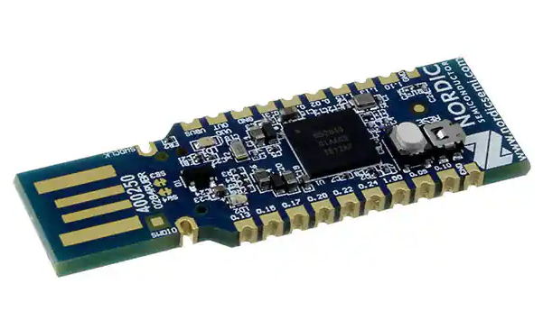
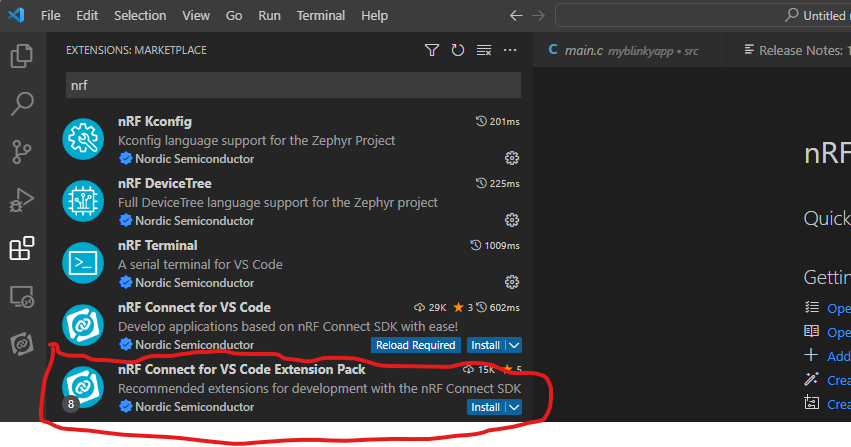

# [CSE190/291 – Wireless & The IoT](../labs.html)

## Lab 1: Introduction to development tools and Bluetooth LE

The purpose of today’s lab is to get you to introduce you to our development environment and tools for the first part of the course, and also get you started with BLE advertisements. 

<h3>Hardware Tools</h3>
We will be using the
<a href"https://www.nordicsemi.com/Products/Development-hardware/nrf52840-dk">nrf52840DK</a>
development kits and the
<a href="https://www.nordicsemi.com/Products/Development-hardware/nrf52840-dongle">nrf52840 Dongle</a>.

<!--
 
-->
<!--- --->

### Software development environment

We will be using Visual Studio Code along with the nrf Connect extension. With this extension, you can directly use VS Code to develop your code, build and create firmware images, download and debug onto the hardware kits directly.

>__Note__: Several users on the internet have reported issues with using the nrf Connect extension on M1-based Mac machines. 
>In particular, there are issues with connecting to your hardware kit using VS Code and downloading the firmware image onto hardware. 
>If possible, try and perform the tasks using an x86 based Mac or a Windows/Linux machine (P.S. Linux machine refers to a native Linux installation, not WSL. If you are on a Windows machine, please use Windows instructions)
>
>It is possible to get things working with M1 Macs also, we just need to be particularly careful with the J-Link tool installation.

[TOC]

---

## PreLab

First, make a copy of the [PreLab2 Report Document][prelab2] to fill in as you work.

### A. Install VS Code with nrf Connect extension

Please install nrfConnect dependencies, VS Code and the nrf Connect extension following these [instructions](https://nrfconnect.github.io/vscode-nrf-connect/connect/install.html)

>__Note__: In some cases, if you already have VS Code installed, Step 6 might give you an error (something like `Can't find a VS Code installation on this machine`).
>This generally happens when the Toolchain Manager can't resolve the path correctly.
>If you know you have VS Code installed, at this stage an easier workaround is to install the extension directly from VS Code.
>Search for and install `nrf Connect for VS Code Extension Pack` extension.
> 

__There is no deliverable for this section.__

### B. Build and flash a sample project on your nrf52840DK

We will now build and flash an example project to verify if everything is installed correctly.
To create and build an example project, go through the [tutorials](https://nrfconnect.github.io/vscode-nrf-connect/connect/create_app.html) on the nrfconnect website.
In particular, look at the tutorials on `Creating an Application`,`Building an An Application` and `Debugging an Application`.
There is also a Youtube playlist of [video tutorials](https://youtube.com/playlist?list=PLx\_tBuQ\_KSqEt7NK-H7Lu78lT2OijwIMl); videos 2-5 are helpful.

**PreLab Q1:** Build and flash the `hello world` code example. This can be found in examples under `zephyr/samples/basic/blinky`. Record a small video showing the blinking LED.

---

### C. Install the nrf Sniffer for BLE

To be able to actually capture BLE traffic in the vicinity, we will be using the nRF Sniffer for BLE application. 
This application provides a firmware image to be installed on the nrf52840 dongle, and a custom Wireshark plugin that allows you to view the captured packets on Wireshark.
To install follow the instructions provided [here](https://infocenter.nordicsemi.com/index.jsp?topic=%2Fug_sniffer_ble%2FUG%2Fsniffer_ble%2Finstalling_sniffer.html)

**Prelab Q2:** After successful installation, test out if everything works. Just do a small capture of 10-12 BLE advertisement records and post a screenshot

## In-Lab

First, make a copy of the [PostLab Report Document][postlab2] to fill in as you work.

---

## PostLab

Go back and fill in the _PostLab_ questions in the PostLab Report Document.

Once you are finished, submit your report via Gradescope.

[prelab2]: https://docs.google.com/document/d/1GwASNkFf3NoTHxEESIj67JKY-2ZoKp1NOc31knZwKck/
[postlab2]: https://docs.google.com/document/d/1TYY20_l-u9JvsW6Q8QEX1loZm4BFpQMLVlvIyxBv8t4/
[wiresharkSaveDirections]: https://www.wireshark.org/docs/wsug_html_chunked/ChIOSaveSection.html
[politeWifi]: http://web.cs.ucla.edu/~omid/Papers/Hotnets20b.pdf
